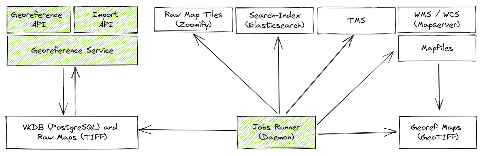
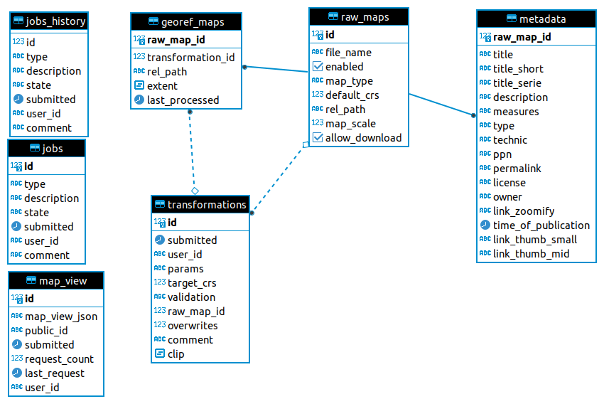

# Documentation

The main purpose of the [Virtual Map Forum 2.0](https://kartenforum.slub-dresden.de/) is to generate georeference historic maps and to serve it over standardized APIs to the public. 

In order to achieve this goal, a number of services are used, that are shown in the following diagram.

The components highlighted in green are python applications whose code is stored in this repository. The basic metadata as well as the transformation and jobs data is stored in a [PostgreSQL/PostGIS](https://www.postgresql.org/) database. The raw maps are stored as plain TIFF files. 

For searching georeferenced maps an [elasticsearch](https://www.elastic.co/) index is used. Georeferenced maps can be access through a Tile Map Service (TMS) or a Web Map Service (WMS) or Web Coverage Service (WCS). The WMS and WCS are served via [Mapserver](https://mapserver.org/).

To generate new transformation for georeferencing historic maps or to insert new raw maps into the data infrastructure the [greoreference service](./GEOREF_SERVICE.md) is used. Sync the different services (Search, TMS, WMS, WCS, Zoomify) with the current state of the source data the [jobs runner](./JOBS_RUNNER.md) is used.

## Database schema

## Import API

The import API allows to create, read, update and delete Raw_Maps.
The documentation for use can be found at [Import API](./IMPORT_API.md).